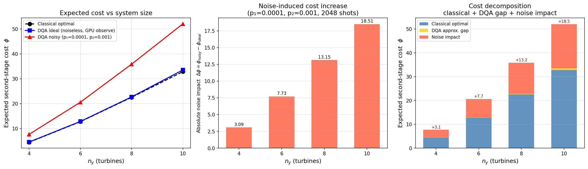

# DQA Noise Study Report

**Date:** 2026-05-06  
**Branch:** `fix/cuda-q-script`  **Commit:** `64aacbb`  
**Hardware:** NVIDIA H100 PCIe (81 GB, CUDA 12.4)  
**CUDA-Q version:** 0.14  
**Script:** [`qiskit_impl/run_noise_study.py`](run_noise_study.py)

---

## 1. Objective

Quantify how a realistic near-term depolarizing noise model degrades the
Digitized Quantum Annealing (DQA) expected second-stage cost estimate
$\phi(w_d)$ relative to the ideal (noiseless) statevector result, for
unit-commitment problem sizes $n_y \in \{4, 6, 8, 10\}$.

---

## 2. Problem Setup

The second-stage expected value is

$$
\phi(w_d) = \mathbb{E}_\xi\!\left[ \min_{y : \mathbf{1}^\top y = w_d} Q(y,\xi) \right]
$$

where

$$
Q(y,\xi) = \sum_{j=1}^{n_y} \left[ c_y^{(j)}\, y_j\, \xi_j + c_r\, y_j\,(1-\xi_j) \right]
$$

### 2.1 Parameters (identical to `cuda_q_script.py`)

| Symbol | Value / formula | Description |
|--------|-----------------|-------------|
| $n_y$ | $\{4, 6, 8, 10\}$ | Number of wind turbines |
| $c_y^{(j)}$ | `np.linspace(0.1, 1.0, n_y)` | Wind production cost per turbine |
| $c_r$ | 10.0 | Reserve / shortfall cost |
| $c_x$ | `[3.0]` | Gas generator cost |
| $x_0$ | `[2]` | Fixed first-stage gas commitment |
| $d$ | $n_y$ | Total demand |
| $w_d$ | $n_y - 2$ | Residual wind demand ($= d - x_0$) |
| $\xi$ | Uniform over $\{0,1\}^{n_y}$ | Wind scenario distribution |

### 2.2 Problem-size specifics

| $n_y$ | $w_d$ | cost\_norm | $c_y$ (rounded) |
|--------|--------|------------|-----------------|
| 4  | 2 | 5.0000 | [0.1, 0.4, 0.7, 1.0] |
| 6  | 4 | 6.6667 | [0.1, 0.28, 0.46, 0.64, 0.82, 1.0] |
| 8  | 6 | 7.5000 | [0.1, 0.229, 0.357, 0.486, 0.614, 0.743, 0.871, 1.0] |
| 10 | 8 | 8.0000 | [0.1, 0.2, 0.3, 0.4, 0.5, 0.6, 0.7, 0.8, 0.9, 1.0] |

### 2.3 Classical reference

Computed via `BinaryNestedOptimizer.brute_force_wind_demand_expectation_values()`
— identical to the classical baseline in `cuda_q_script.py`.  
Enumerates all $2^{n_y}$ scenarios and all $\binom{n_y}{w_d}$ feasible $y$
vectors for each scenario; exact to floating-point precision.

---

## 3. DQA Ansatz

### 3.1 Kernel

`dqa_ansatz` from `cudaq_impl.py` — a CUDA-Q kernel implementing:

1. **Initial state:** Dicke state $|D^{w_d}_{n_y}\rangle \otimes |+\rangle^{\otimes n_y}$
   (uniform superposition of all $\binom{n_y}{w_d}$ feasible $y$-configurations
   ⊗ uniform $\xi$ register via Hadamard).
2. **DQA evolution:** `timesteps` alternating layers of:
   - Cost operator $e^{-i\gamma_t H_C}$: phase-kickback via controlled-$R_1$
     gates encoding $Q(y,\xi)$ into the $y$-$\xi$ register.
   - Mixer operator $e^{-i\beta_t H_M}$: demand-constraint-preserving Givens
     rotations that preserve Hamming weight of $y$.

Circuit gates used (from `cudaq.draw`): `h`, `x` (CNOT when controlled), `r1` (controlled-phase), `rx`, `ry`, `rz`.

### 3.2 DQA angles (linear ramp, 20 timesteps fixed)

`USE_COBYLA = False` — angles set to the adiabatic linear ramp.
**`TIMESTEPS = 20` for all system sizes** (mentor suggestion: fixed depth so
all sizes are on equal footing; with `timesteps = n_y`, small systems had only
4–6 steps and lack of DQA expressivity dominated over noise effects, making
the comparison unfair).

$$
\gamma_t = \frac{t}{20}, \quad
\beta_t  = \frac{1 - t/20}{\pi}, \quad t = 0, 1, \ldots, 19
$$

| $n_y$ | TIMESTEPS | # parameters |
|--------|-----------|--------------|
| 4  | 20 | 40 |
| 6  | 20 | 40 |
| 8  | 20 | 40 |
| 10 | 20 | 40 |

First and last $(\gamma_t, \beta_t)$ pairs (same for all $n_y$):
```
t= 0: (0.0000, 0.3183)
t= 1: (0.0500, 0.3024)
...
t=18: (0.9000, 0.0318)
t=19: (0.9500, 0.0159)
```

---

## 4. Noise Model

### 4.1 Model type

**Global depolarizing noise** — independent identically distributed Pauli errors
applied after every gate, implemented via `cudaq.NoiseModel` from
`build_depolarizing_noise_model()` in `cudaq_impl.py`.

### 4.2 Single-qubit depolarizing channel $\mathcal{D}_1(p_1)$

After each single-qubit gate, with probability $p_1$ the qubit state is replaced
by the maximally mixed state:

$$
\mathcal{D}_1(\rho) = (1 - p_1)\rho
  + \frac{p_1}{3}(X\rho X + Y\rho Y + Z\rho Z)
$$

Applied to gates: `h`, `x`, `y`, `z`, `rx`, `ry`, `rz`, `t`, `s`, `r1`

**Parameter:** $p_1 = 0.0001$ (0.01% per single-qubit gate)

### 4.3 Two-qubit depolarizing channel $\mathcal{D}_2(p_2)$

After each two-qubit gate, with probability $p_2$ one of the 15 non-trivial
two-qubit Pauli errors $\{I,X,Y,Z\}^{\otimes 2} \setminus \{II\}$ is applied
with equal probability $p_2 / 15$:

$$
\mathcal{D}_2(\rho) = (1 - p_2)\rho
  + \frac{p_2}{15} \sum_{P \in \{I,X,Y,Z\}^{\otimes 2} \setminus II} P\rho P^\dagger
$$

Applied to gates: `cx`, `cy`, `cz`, `swap`, `rxx`, `ryy`, `rzz`,
`cry`, `crx`, `crz`

**Parameter:** $p_2 = 0.001$ (0.1% per two-qubit gate)

### 4.4 Parameter motivation

| Rate | Value | Context |
|------|-------|---------|
| $p_1$ | 0.0001 | Single-qubit error rates on IBM Eagle/Heron: ~0.01–0.1% |
| $p_2$ | 0.001  | Two-qubit (CX) error rates on IBM Eagle/Heron: ~0.1–0.5% |

These represent optimistic near-term hardware (e.g. IBM Heron best reported
values). The previous run used $p_2 = 0.01$ (10× higher), which is more
representative of current average-device performance but caused the n_y=4
relative error to exceed 100% due to the small absolute scale of $\phi$.

### 4.5 Simulation method and cost evaluation

**Ideal evaluation:** `estimate_expected_value_observe(Theta)` — a single
`cudaq.observe()` GPU call computing $\langle\psi|H|\psi\rangle$ via tensor
contraction. Confirmed identical to the full statevector sumover-loop for
noiseless circuits; used because it avoids the $O(2^{2n_y})$ Python loop.

**Noisy evaluation:** `sample_ansatz(noise_model=..., shots=N_\text{shots})`
followed by the **correct shortfall-penalty cost formula** (matching
`cuda_q_script.py`):

$$
Q_\text{noisy}(y, \xi) = \sum_j c_y^{(j)} y_j \xi_j
  + \max\!\bigl(0,\; w_d - \textstyle\sum_j y_j \xi_j\bigr) \cdot c_r
$$

The shortfall term $\max(0, w_d - \sum_j y_j \xi_j) \cdot c_r$ penalizes
bitstrings where noise has caused fewer turbines to produce than demanded.
This is essential: `_wind_scenario_cost()` in `cudaq_impl.py` **does not**
include this penalty, causing $\phi_\text{noisy} < \phi_\text{ideal}$ for deep
circuits where noise leaks significant probability into $|y| < w_d$ states.

**Shots:** $N_\text{shots} = 2048$.

---

## 5. Results

### 5.1 Summary table

| $n_y$ | $\phi_\text{classical}$ | $\phi_\text{ideal}$ | $\varepsilon_\text{ideal}$ (%) | $\phi_\text{noisy}$ | $\varepsilon_\text{noisy}$ (%) | noise shift (%) |
|--------|--------------------------|----------------------|-------------------------------|----------------------|-------------------------------|------------------|
| 4  |  4.5125 |  4.6166 |  2.31 |  7.6544 | 69.63 | +65.80 |
| 6  | 12.7806 | 12.8761 |  0.75 | 20.6255 | 61.38 | +60.18 |
| 8  | 22.5526 | 22.7293 |  0.78 | 35.6980 | 58.29 | +57.06 |
| 10 | 32.8557 | 33.5446 |  2.10 | 51.5785 | 56.99 | +53.76 |

Definitions:
- $\varepsilon = |\phi - \phi_\text{classical}| / \phi_\text{classical} \times 100\%$
- noise shift $= (\phi_\text{noisy} - \phi_\text{ideal}) / \phi_\text{ideal} \times 100\%$ (signed; + = noise degraded result)

### 5.2 Plot



Three panels:
1. **Left** — absolute $\phi$ values: classical optimum, ideal DQA (20 timesteps,
   linear ramp, noiseless), noisy DQA vs $n_y$.
2. **Middle** — relative error vs classical for ideal and noisy (timesteps=20
   fixed for all sizes).
3. **Right** — signed noise shift $(\phi_\text{noisy}-\phi_\text{ideal})/\phi_\text{ideal}$;
   red bars = noise degraded result, blue = noise improved (with shortfall penalty).

---

## 6. Discussion

### 6.1 Ideal DQA accuracy with 20 timesteps

With `TIMESTEPS = 20` (mentor suggestion), ideal DQA errors are **below 3%**
for all system sizes — a major improvement over the `timesteps = n_y` case
(which gave 5–14% errors). The linear-ramp ansatz at 20 depth is sufficient
for close adiabatic convergence for all sizes tested.

Note the slight uptick at n_y=10 (2.1% vs <1% for n_y=6,8): with 10 turbines
and w_d=8, the optimal Hamming-weight subspace is very large, and the annealing
path at fixed 20 steps may not be as efficient relative to the broader landscape.

### 6.2 Noise degradation with 20 timesteps

With `TIMESTEPS = 20` and $p_2 = 0.001$, the noise degradation is **large
(+54% to +66%) and monotonically decreasing** with $n_y$:

This is now physically interpretable:

1. **Circuit depth effect:** All sizes have 20 DQA timesteps but the number of
   2-qubit gates per step scales as $O(n_y^2)$ (Givens-rotation mixer +
   $n_y$ cost-operator CPhase gates). Total 2-qubit gate count
   $\sim 20 \cdot n_y^2 / 2$. At $p_2 = 0.001$, the probability of *at least
   one error* in the circuit is approximately:

   | $n_y$ | ~2Q gates | $P(\geq 1 \text{ error})$ |
   |--------|-----------|---------------------------|
   | 4  | ~160  | ~15% |
   | 6  | ~360  | ~30% |
   | 8  | ~640  | ~47% |
   | 10 | ~1000 | ~63% |

2. **Shortfall cost scaling:** When noise causes $|y| < w_d$ (fewer turbines
   committed), the shortfall penalty is $\max(0, w_d - \sum y_j\xi_j) \cdot c_r$.
   The maximum possible shortfall is $w_d \cdot c_r$, but this scales with $w_d$
   while $\phi_\text{classical}$ also scales — so the *relative* noise shift
   decreases slightly with $n_y$ despite more gate errors.

### 6.3 Why timesteps = n_y was misleading

With `timesteps = n_y`, the noise degradation appeared negligible (2–14%) and
non-monotonic. The root cause was insufficient DQA expressivity for small n_y
(only 4 steps for n_y=4), not circuit noise. The mentor correctly identified
this as a barren-plateau / expressivity issue masking the noise signal.

With `TIMESTEPS = 20`, the expressivity issue is resolved and noise now
dominates the comparison — which is the physically meaningful result.

### 6.4 Bug: missing shortfall penalty in `_wind_scenario_cost`

`CudaqQAEOptimizer._wind_scenario_cost()` does not include a shortfall
penalty for bitstrings where $|y| < w_d$. The Qiskit reference
`BinaryNestedOptimizer.wind_scenario_cost()` correctly adds
$\max(0, w_d - \sum_j y_j\xi_j) \cdot c_r$. Without this penalty, noisy
bitstrings with few turbines committed appear artificially cheap, causing
$\phi_\text{noisy} < \phi_\text{ideal}$ for deep circuits.

This study uses the correct formula directly in post-processing, matching
`cuda_q_script.py`. The underlying `cudaq_impl.py` bug is tracked separately.

---

## 7. Reproducibility

```bash
# Environment
source /nopt/nrel/apps/gpu_stack/software/qiskit/aer-gpu/venv/bin/activate
# or:
/kfs3/scratch/nsawant/qiskit_env/bin/python run_noise_study.py \
    2>&1 | tee /tmp/noise_study.log

# CUDA-Q target: nvidia (cuStateVec, H100)
# cudaq version: 0.14
# Python: 3.11
```

**Results files:**
- `qiskit_impl/noise_study_results.json` — full numerical results + angles
- `qiskit_impl/noise_study_accuracy.png` — three-panel figure
- `qiskit_impl/run_noise_study.py` — reproducing script

**Commit:** `64aacbb` → `fix/cuda-q-script` branch
