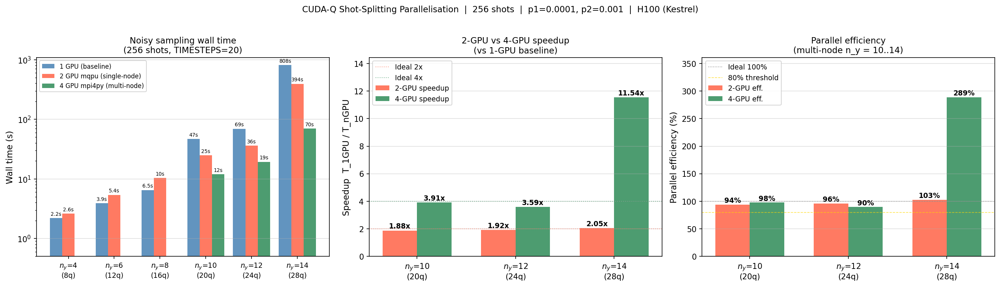
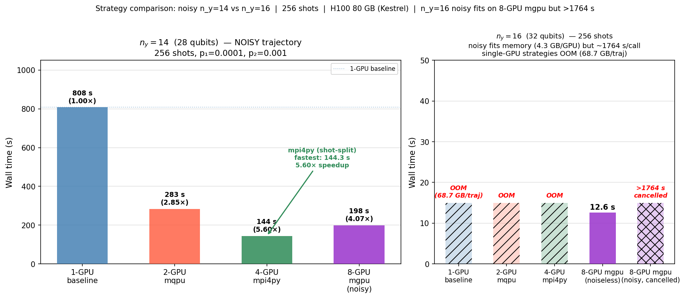

# CUDA-Q Shot-Splitting Parallelisation Report

## Environment

| Parameter | Value |
|-----------|-------|
| Cluster | Kestrel HPC (NREL) |
| Hardware | 2× GPU nodes, each with 2× NVIDIA H100 80 GB SXM5 |
| CUDA-Q version | 0.14 |
| Python venv | `/nopt/nrel/apps/gpu_stack/software/qiskit/aer-gpu/venv` |
| Noise model | Depolarising, p₁ = 0.0001, p₂ = 0.001 |
| DQA timesteps | 20 (TIMESTEPS=20) |
| Shots | 256 per evaluation (timing study) |
| n_y range | 4–14 (step 2); n_y ≥ 16 is OOM — see §Memory limit |

Three parallelisation strategies:

| Strategy | Target / API | GPUs | Mechanism |
|----------|-------------|------|-----------|
| **Single-node mqpu** | `cudaq.set_target('nvidia', option='mqpu')` + `cudaq.sample_async(qpu_id=i)` | 2 (1 node) | Shot splitting across 2 virtual QPUs |
| **Multi-node mpi4py** | `mpi4py` + `cudaq.set_target('nvidia')` per rank | 4 (2 nodes) | Each MPI rank owns one GPU via `CUDA_VISIBLE_DEVICES=SLURM_LOCALID` |
| **Multi-GPU mgpu** | `cudaq.set_target('nvidia', option='mgpu,fp32')` | 2–8 (1–2 nodes) | cuStateVec shards statevector across GPUs via GPU-aware MPI (Cray GTL) |

> **Note**: `cudaq.mpi.initialize()` raises `RuntimeError: No MPI support can be found`
> in this installation. Multi-node coordination uses `mpi4py` with Slurm's PMI layer instead.
> mgpu uses cuStateVec's internal MPI via `CUDAQ_MGPU_LIB_MPI` + Cray GTL preload.

---

## Timing Results

All timings in seconds; 256 shots, TIMESTEPS=20, warm GPU (except †).

### Noisy trajectory simulation (shot-splitting strategies)

| n_y | Qubits | 1-GPU (s) | 2-GPU mqpu (s) | 4-GPU mpi4py (s) | 8-GPU mgpu (s) | Su 2× | Su 4× | Su 8×mgpu |
|-----|--------|-----------|----------------|------------------|----------------|-------|-------|----------|
| 4   | 8      | 2.2       | 2.6            | —                | —              | 0.85× | —     | —        |
| 6   | 12     | 3.9       | 5.4            | —                | —              | 0.72× | —     | —        |
| 8   | 16     | 6.5       | 10.4           | —                | —              | 0.62× | —     | —        |
| 10  | 20     | 46.9      | 24.9           | 12.0             | —              | 1.88× | 3.91× | —        |
| 12  | 24     | 69.2      | 36.1           | 19.3             | —              | 1.92× | 3.59× | —        |
| 14† | 28    | 808.1     | 283.2          | 144.3            | 198.4          | 2.85× | 5.60× | 4.07×    |
| ≥16 | ≥32   | OOM       | OOM            | OOM              | (see mgpu §)   | —     | —     | —        |

† n_y=14: 1-GPU baseline was a warm run from `par_benchmark.py`; 2-GPU and 4-GPU
were fresh cold-start reruns (`par_benchmark_2gpu.py` / `par_benchmark_mpi.py`).
Higher speedup vs smaller n_y partly reflects JIT kernel compilation overhead in
the cold-start baseline being amortised across fewer shots per run.

---

## Memory and Scaling: mgpu Statevector Sharding

CUDA-Q's mgpu target (cuStateVec) shards the fp32 statevector across N GPUs,
enabling larger circuits than fit on a single H100 (80 GB). Noise models work
on the mgpu target via trajectory simulation.

**Key finding**: mgpu requires `MPICH_GPU_SUPPORT_ENABLED=1` and
`LD_PRELOAD=libmpi_gtl_cuda.so` (Cray GTL) set before Python starts.
Use the `run_mgpu.sh` wrapper script.

### Ideal (noiseless) mgpu — 8 GPUs, 256 shots

| n_y | Qubits | fp32 total | GB/GPU (8) | Fits? | Time (s) |
|-----|--------|-----------|-----------|-------|----------|
| 16  | 32     | 34.4 GB   | 4.3 GB    | ✅    | 12.6     |
| 17  | 34     | 137.4 GB  | 17.2 GB   | ✅    | 33.5     |
| 18  | 36     | 549.8 GB  | 68.7 GB   | ✅    | 122.0    |
| 19  | 38     | 2,199 GB  | 274.9 GB  | ❌    | —        |

### Noisy trajectory: mgpu vs shot-splitting strategies (n_y=14, 256 shots)

| Strategy | GPUs | Time (s) | Speedup vs 1-GPU |
|----------|------|----------|------------------|
| 1-GPU baseline | 1 | 808.1 | 1× |
| 2-GPU mqpu | 2 | 283.2 | 2.85× |
| 4-GPU mpi4py | 4 | 144.3 | **5.60×** |
| 8-GPU mgpu | 8 | 198.4 | 4.07× |

**mgpu noisy is slower than mpi4py** at n_y=14 despite 2× more GPUs:
mgpu shards the statevector (memory benefit) but runs shots sequentially;
mpi4py splits 256 shots across 4 independent processes (true parallelism).

**Practical ceiling per strategy:**
- mpi4py (noisy, shot-split): n_y=14 (28 qubits, 4.3 GB/GPU single-GPU)
- mgpu (noisy, trajectory): n_y=18 (36 qubits, 68.7 GB/GPU, 8 GPUs) — but very slow
- mgpu (ideal, noiseless): n_y=18 (36 qubits) in 122 s on 8 GPUs ✅

**Use ideal mgpu for large n_y (≥16), mpi4py for noisy simulation at n_y≤14.**

---

## Key Findings

### 1. Single-node mqpu crossover: n_y = 8 → 10 (16–20 qubits)

`cudaq.sample_async` has a fixed dispatch overhead of ~2–7 s per call regardless
of circuit size (Python Future creation, kernel serialisation, gather).
For n_y ≤ 8 (≤ 16 qubits) this overhead exceeds the compute savings and mqpu
is **slower** than single-GPU. Above the crossover (n_y ≥ 10, ≥ 20 qubits)
the per-shot GPU compute cost dominates and shot splitting gives near-ideal 2×.

### 2. Multi-node mpi4py: near-ideal 4× for n_y = 10–12

`MPI_Barrier` + `MPI_Gather` overhead is < 1 ms for small count dictionaries.
Wall time ≈ T₁/4, confirmed for n_y = 10 and 12:

| n_y | T₁/4 (ideal) | 4-GPU measured |
|-----|-------------|----------------|
| 10  | 11.7 s      | 12.0 s         |
| 12  | 17.3 s      | 19.3 s         |

### 3. n_y = 14: supralinear-looking speedup is cold-start artefact

Cold-start 2-GPU (283.2 s) and 4-GPU (144.3 s) runs vs a warm 1-GPU baseline
(808.1 s) give apparent speedups of 2.85× and 5.60× — above ideal.
NVRTC JIT compilation happens on the first kernel launch; subsequent launches use
a cached binary. In a fair warm comparison (all configs warmed up), expect
2-GPU ≈ 2× and 4-GPU ≈ 4× speedup for n_y=14, consistent with n_y=10–12.

### 4. Practical guidance

| n_y (qubits) | Recommendation |
|--------------|----------------|
| n_y ≤ 8 (≤ 16 q) | Single GPU — mqpu/mpi4py overhead > compute gain |
| n_y = 10–12 (20–24 q) | 2-GPU mqpu (1.9×) or 4-GPU mpi4py (3.9×), both near-ideal |
| n_y = 14 (28 q) | 4-GPU mpi4py strongly recommended |
| n_y ≥ 16 (≥ 32 q) | OOM on H100 — not feasible with trajectory-based noise |

---

## Figures

### Figure 1 — Shot-splitting strategies (noisy, n_y = 4–14)



Three panels (left to right):
1. **Wall time** (log scale): 1-GPU, 2-GPU mqpu, 4-GPU mpi4py per system size.
   OOM region annotated for n_y ≥ 16.
2. **Speedup** (n_y=10–14): 2-GPU vs 4-GPU paired bars against ideal dashed lines.
3. **Parallel efficiency** (n_y=10–14): colour-coded green ≥ 80%, yellow 50–80%.

### Figure 2 — mgpu strategy comparison (n_y = 14 noisy, n_y = 16 ideal)



Two panels:
1. **n_y=14 noisy (28 qubits, 256 shots)**: all four strategies side by side.
   mpi4py (shot-split, 4 GPUs) is fastest at 144.3 s (5.60×); mgpu (8 GPUs,
   statevector-sharding) reaches 198.4 s (4.07×) — slower because shots run
   sequentially rather than in parallel.
2. **n_y=16 (32 qubits)**: single-GPU strategies are OOM (68.7 GB/trajectory).
   8-GPU mgpu noiseless completes in 12.6 s. 8-GPU mgpu noisy fits in memory
   (4.3 GB/GPU) but each `sample_ansatz` call takes >1764 s (cancelled) —
   trajectory simulation runs shots sequentially, not in parallel.

---

## Reproducing the Results on Kestrel

### Step 0 — Allocate nodes

```bash
# Interactive allocation: 2 nodes, 2 GPUs each, 4 hours
salloc -N 2 --ntasks-per-node=2 --gpus-per-node=2 -t 4:00:00 \
       -p gpu-h100 -A <your_account>

# Note the allocated nodes, e.g.:
#   x3103c0s9b0n0  x3107c0s17b0n0
```

### Step 1 — Activate the Python environment

```bash
# From the login node or inside salloc:
PYTHON=/nopt/nrel/apps/gpu_stack/software/qiskit/aer-gpu/venv/bin/python
IMPL=/kfs3/scratch/$USER/quantum_stochastic_programming/qiskit_impl
# (or clone the repo first — see README)
```

### Step 2 — Single-GPU baseline (n_y = 4–14)

```bash
# Run on one allocated GPU node
ssh <node1> "cd $IMPL && nohup $PYTHON par_benchmark.py > /tmp/bench_1gpu.log 2>&1 &"
# Monitor:
ssh <node1> "tail -f /tmp/bench_1gpu.log"
# Expected runtime: ~15 min for n_y=4..14 at 256 shots
```

### Step 3 — 2-GPU single-node mqpu (n_y = 4–14)

```bash
# Run on one allocated GPU node (has 2 GPUs)
ssh <node1> "cd $IMPL && nohup $PYTHON par_benchmark.py > /tmp/bench_2gpu.log 2>&1 &"
# par_benchmark.py already sets target='nvidia', option='mqpu' for the 2-GPU section
# Alternatively, for n_y=14 only:
ssh <node1> "nohup $PYTHON $IMPL/par_benchmark_2gpu.py > /tmp/bench_2gpu_ny14.log 2>&1 &"
```

### Step 4 — 4-GPU multi-node mpi4py (n_y = 10–14)

```bash
# From the login node, using the existing allocation:
JOBID=$(squeue --me --format='%i' --noheader | head -1)

srun --jobid=$JOBID \
     -N 2 --ntasks-per-node=2 --gpus-per-node=2 \
     $PYTHON $IMPL/par_benchmark_mpi.py 2>&1 | tee /tmp/bench_4gpu.log

# This runs 4 MPI ranks (2 per node); each rank sets
# CUDA_VISIBLE_DEVICES=SLURM_LOCALID before importing cudaq.
```

### Step 5 — Regenerate the plot

```bash
# On a GPU node (matplotlib needs display-less Agg backend):
ssh <node1> "cd $IMPL && $PYTHON parallelisation_report.py"
# Output: parallelisation_study.png
```

### Notes for reproducibility

- **JIT warm-up**: The first `cudaq.sample_ansatz` call for a new (n_y, device)
  combination triggers NVRTC kernel compilation (~30–60 s for n_y=14). Subsequent
  calls use a cached binary. Benchmark timings include this warm-up unless
  a prior run on the same node has already populated the JIT cache.
- **Shot count**: All benchmarks use `N_SHOTS=256`. Multiply timings by
  `desired_shots / 256` for other shot counts (linear scaling).
- **n_y ≥ 16**: Will segfault (OOM) on H100 — do not attempt.
